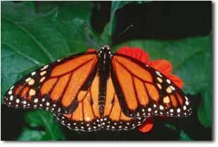

# 📸 Segmentasi Gambar dengan K-Means Clustering

Selamat datang di proyek Segmentasi Gambar menggunakan K-Means Clustering! Proyek ini menunjukkan bagaimana menggunakan OpenCV dan NumPy untuk membagi gambar menjadi klaster yang berbeda berdasarkan warna pixel. 🖼️✨

## Hasil Project

hasil dari project ini adalah adanya perbedaan antara gambar asli dan gambar yang sudah di klastering untuk kasus ini saya membagi jadi 3 warna klaastering / cluster
dan hasil dari itu gambar hasil yang ditampilkan berupa gambar yang hanya ada 3 warna dominan didalamnya seperti pada gambar dibawah ini

Gambar Asli

<br>
Gambar Setelah di Segmentasi
{ width="50%" }

## 🛠️ Instalasi

Sebelum memulai, pastikan Anda telah menginstal library yang diperlukan. Berikut langkah-langkahnya:

1. **Buka Command Prompt atau Terminal.**

2. **Instal OpenCV:**
   ```sh
   pip install opencv-python
   ```
3. **Instal versi spesifik dari NumPy:**
   ```sh
   pip uninstall -y numpy
   pip install numpy==1.21
   ```
4. **(Opsional) Instal Jupyter Notebook:**
   ```sh
   pip install jupyterlab
   ```

## 🚀 Memulai

Anda dapat menjalankan kode segmentasi gambar ini di Jupyter Notebook. Berikut panduan langkah demi langkah untuk membuat notebook Anda sendiri:

1. **Mulai Jupyter Notebook:**

   ```sh
   jupyter notebook

   ```

2. **Buat Notebook Python baru dan tambahkan sel-sel berikut:**

```python
# Sel 1: Instal OpenCV dan Downgrade NumPy
!pip install opencv-python
!pip uninstall -y numpy
!pip install numpy==1.21
# Sel 2: Impor Library dan Verifikasi Versi
import numpy as np
import matplotlib.pyplot as plt
import cv2
print(f"Versi NumPy: {np.**version**}")
print(f"Versi OpenCV: {cv2.**version**}")

# Sel 3: Baca dan Tampilkan Gambar Asli

# Membaca gambar, sesuaikan path dengan lokasi gambar Anda

image = cv2.imread('images/monarch.jpg')

# Ubah warna gambar dari BGR ke RGB

image = cv2.cvtColor(image, cv2.COLOR_BGR2RGB)

# Tampilkan gambar asli

plt.imshow(image)
plt.title('Gambar Asli')
plt.axis('off')
plt.show()

# Sel 4: Segmentasi Gambar menggunakan K-Means Clustering

# Ubah gambar menjadi array piksel 2D dengan 3 nilai warna (RGB)

pixel_vals = image.reshape((-1,3))

# Konversi tipe data menjadi float32

pixel_vals = np.float32(pixel_vals)

# Tentukan kriteria untuk algoritme k-means

criteria = (cv2.TERM_CRITERIA_EPS + cv2.TERM_CRITERIA_MAX_ITER, 100, 0.85)

# Tentukan jumlah klaster

k = 3

# Lakukan k-means clustering

retval, labels, centers = cv2.kmeans(pixel_vals, k, None, criteria, 10, cv2.KMEANS_RANDOM_CENTERS)

# Konversi data menjadi nilai 8-bit

centers = np.uint8(centers)

# Ubah data menjadi dimensi gambar asli

segmented_data = centers[labels.flatten()]
segmented_image = segmented_data.reshape((image.shape))

# Tampilkan gambar hasil segmentasi

plt.imshow(segmented_image)
plt.title('Gambar Tersegmentasi')
plt.axis('off')
plt.show()
```

3. **Jalankan setiap sel dalam notebook secara berurutan untuk menjalankan kode.**

## 📚 Penjelasan Kode

### Sel 1: Instal OpenCV dan Downgrade NumPy

Sel ini menginstal library OpenCV (cv2) dan downgrade NumPy ke versi 1.21 untuk memastikan kompatibilitas dengan modul yang ada.

### Sel 2: Impor Library dan Verifikasi Versi

Pada sel ini, kami mengimpor library yang diperlukan: NumPy, Matplotlib, dan OpenCV. Kami juga mencetak versi NumPy dan OpenCV untuk memastikan instalasi berhasil.

```python
import numpy as np
import matplotlib.pyplot as plt
import cv2
print(f"Versi NumPy: {np.__version__}")
print(f"Versi OpenCV: {cv2.__version__}")
```

### Sel 3: Baca dan Tampilkan Gambar Asli

Sel ini membaca sebuah gambar dari path yang ditentukan dan mengubah warna gambar dari BGR ke RGB. Kemudian, gambar asli ditampilkan menggunakan Matplotlib.

```python
# Membaca gambar, sesuaikan path dengan lokasi gambar Anda
image = cv2.imread('images/monarch.jpg')

# Ubah warna gambar dari BGR ke RGB
image = cv2.cvtColor(image, cv2.COLOR_BGR2RGB)

# Tampilkan gambar asli
plt.imshow(image)
plt.title('Gambar Asli')
plt.axis('off')
plt.show()
```

### Sel 4: Segmentasi Gambar menggunakan K-Means Clustering

Sel ini melakukan segmentasi gambar menggunakan algoritme K-Means clustering. Gambar diubah menjadi array piksel 2D dengan 3 nilai warna (RGB), kemudian dikonversi ke float32. Hasil segmentasi ditampilkan sebagai gambar tersegmentasi.

```python
# Ubah gambar menjadi array piksel 2D dengan 3 nilai warna (RGB)
pixel_vals = image.reshape((-1,3))

# Konversi tipe data menjadi float32
pixel_vals = np.float32(pixel_vals)

# Tentukan kriteria untuk algoritme k-means
criteria = (cv2.TERM_CRITERIA_EPS + cv2.TERM_CRITERIA_MAX_ITER, 100, 0.85)

# Tentukan jumlah klaster
k = 3

# Lakukan k-means clustering
retval, labels, centers = cv2.kmeans(pixel_vals, k, None, criteria, 10, cv2.KMEANS_RANDOM_CENTERS)

# Konversi data menjadi nilai 8-bit
centers = np.uint8(centers)

# Ubah data menjadi dimensi gambar asli
segmented_data = centers[labels.flatten()]
segmented_image = segmented_data.reshape((image.shape))

# Tampilkan gambar hasil segmentasi
plt.imshow(segmented_image)
plt.title('Gambar Tersegmentasi')
plt.axis('off')
plt.show()
```

## 🌟 Hasil

Setelah menjalankan notebook, Anda akan melihat dua gambar: gambar asli dan gambar yang sudah tersegmentasi. Gambar tersegmentasi akan menampilkan piksel yang dikelompokkan ke dalam klaster berdasarkan warna mereka, menciptakan representasi visual yang berbeda dari gambar asli.

Nikmati eksperimen dengan segmentasi gambar menggunakan K-Means clustering! 🎨🚀
